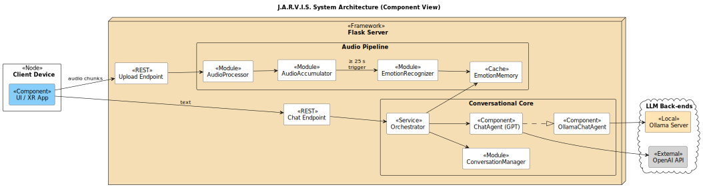

# J.A.R.V.I.S. — Just An Adaptive Real-time Voice Interactive System

An adaptive voice-assistant backend that combines real-time audio buffering, vocal-emotion detection and large-language-model reasoning.  
Designed to plug into any client (mobile, XR, web) via a lightweight REST API.

---

## ✨ Key Features
| Capability | Description |
|------------|-------------|
| **Client-side ASR** | The client transcribes speech locally (e.g., Whisper) and sends plain text to the server. |
| **Audio buffering & emotion inference** | Audio clips are posted to `/upload_audio`; once the accumulated length reaches **25 s** (configurable) the server runs a single emotion-recognition pass and caches the result for **30 s**. |
| **Adaptive prompt orchestration** | The `/chat_message` endpoint merges the latest emotions (if still fresh) with the user text to craft an empathetic prompt. |
| **Dual LLM backend** | Switch between **OpenAI GPT-4o-mini** or a fully local **Ollama** model by toggling one flag. |
| **Stateless JSON logging** | Conversation turns are appended to a per-user JSON file—no database required. |

---

## 🚀 Quick Start

```bash
git clone https://github.com/your-username/JARVIS.git
cd JARVIS
python -m venv venv && source venv/bin/activate        # Windows: venv\Scripts\activate
pip install -r requirements.txt
echo "OPENAI_API_KEY=sk-…" > .env                      # Skip if using Ollama only
python server.py                                       # default: http://127.0.0.1:5001
````

---

## 🌐 REST API

| Endpoint              | Method             | Purpose                                                                                                                                                                            |
| --------------------- | ------------------ | ---------------------------------------------------------------------------------------------------------------------------------------------------------------------------------- |
| `/upload_audio`       | `POST` (multipart) | Send a single audio chunk (`audio` file + `user_id`). Returns<br>`{"status":"buffering"}` until 25 s of audio have been collected, then<br>`{"status":"inferred","emotions":{…}}`. |
| `/chat_message`       | `POST` (JSON)      | `{ "user_id": "...", "text": "..." }` → `{ "response": "..." }`. The server adds cached emotions to the prompt if available (< 30 s old).                                          |
| `/reset_conversation` | `POST` (form)      | Clears in-memory history, emotion cache and the audio buffer for the user.                                                                                                         |

---

## 🏗️ Architecture Overview



**Flow**

1. Client records audio → `POST /upload_audio`.
2. `AudioProcessor` normalises each chunk → `AudioAccumulator` sums duration.
3. At ≥ 25 s total, `EmotionRecognizer` infers the emotion vector and stores it in `EmotionMemory` (TTL 30 s).
4. Client sends text → `POST /chat_message`.
5. `Orchestrator` fetches fresh emotions (if any), builds the prompt and calls either **OpenAI** or **Ollama** via `ChatAgent`.
6. Response is returned and appended to a JSON log.

---

## 🧰 Tech Stack

* **Python 3.11** – Flask REST API
* **FFmpeg** – audio conversion
* **PyTorch + Transformers** – emotion model
* **OpenAI SDK** *or* **Ollama server** – language model
* **Tkinter** demo GUI (optional)

---

## 🤝 Contributing
We welcome contributions! Feel free to:
- **Open a Pull Request** 🛠️
- **Report an Issue** 🐛
- **Suggest a Feature** 🚀

---

## 📜 License

Released under the **MIT License**. See `LICENSE` for details.
