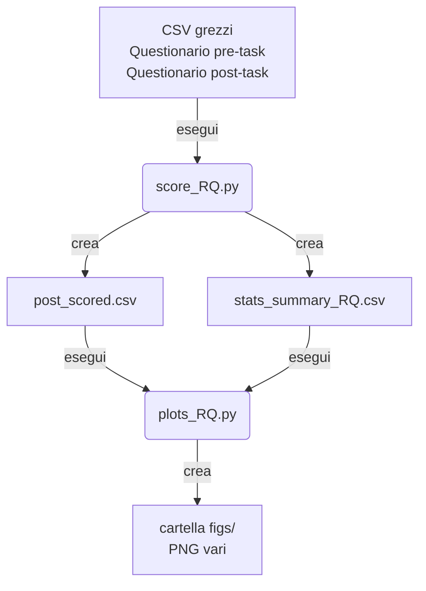

# Guida ai risultati – *score_RQ.py* & *plots_RQ.py*

Questa guida descrive **che cosa** producono i due script, **dove** trovare i file generati e **come leggere** le figure ▸ senza riportare alcun valore numerico.

---
## 1 · Workflow essenziale

> **Tip** · È buona pratica tenere gli script nella root del progetto e lasciare che creino da sé la sotto‑cartella `figs/`.

---
## 2 · File CSV prodotti
| File | Contenuto | A cosa serve |
|------|-----------|--------------|
| **`post_scored.csv`** | Il questionario post‑task **arricchito** con: gruppo (`GROUP`), tutti gli score (PQ, NASA‑TLX, SUS, SASSI_global, Δ SSQ) + metriche oggettive (TCT, Turns). | Base dati "pulita" che *plots_RQ.py* usa per i grafici; comodo per analisi ad‑hoc in Excel / R / Python. |
| **`stats_summary_RQ.csv`** | Una riga per variabile con: numerosità EMO/NEU, media per gruppo, test usato (t o U), statistica, *p*‑value, dimensione dell’effetto. | Sintesi statistica pronta da citare nella tesi; *plots_RQ.py* ci legge i *p* per annotare i grafici. |

---
## 3 · Figure generate (cartella `figs/`)

| Prefisso file | Tipo di grafico | Cosa mostra | Come leggerlo | Quando citarlo |
|---------------|----------------|-------------|---------------|----------------|
| `box_<var>.png` | **Box + Swarm‐plot** per singola variabile | Distribuzione completa (mediana, IQR, outlier) + punti individuali. | Confronta forma & sbilanciamento tra EMO (sx) e NEU (dx). Ideale per intuire varianza e simmetria. | Se vuoi far vedere la *dispersione* o singoli casi particolari. |
| `bar_<var>.png` | **Barra media ± 95 % CI** con *p* | Media di gruppo, intervallo di confidenza bootstrap e *p* del test. | Controlla se le CI si sovrappongono; il *p* annotato deriva dallo stesso test riportato a tabella. | Per enfatizzare differenze «significative» in modo compatto. |
| `forest_effectsize.png` | **Forest plot** delle dimensioni dell’effetto | Tutte le variabili in colonna, punto nero sulla scala d / δ (zero = nessuna differenza). | • Valori > 0: EMO > NEU · Valori < 0: EMO < NEU  ▶ Interpreta magnitudine con soglie Cohen/Cliff (∼0.2 piccolo, ∼0.5 medio, ≥0.8 grande). | Quando vuoi dare una panoramica unica delle differenze tra gruppi. |
| `scatter_TCT_*`, `scatter_Turns_*` | **Scatter + regressione** (esplorativo) | Relazione lineare fra metriche oggettive (TCT, Turns) e punteggi soggettivi (PQ, NASA‑TLX, SUS). | Ogni punto è un partecipante; linea tratteggiata = fit OLS; colore = gruppo. Guarda pendenza & densità. | Se discuti possibili correlazioni fra performance e user experience. |

---
## 4 · Interpretazione rapida
1. **Inizia dal forest plot**: ti dice subito *dove* vale la pena approfondire.
2. **Zoom sui box + swarm** per capire se differenze formali nascondono outlier o asimmetrie.
3. **Bar ± CI** servono nelle slide/tesi perché sono sintetiche e leggibili anche da non‐statistici.
4. **Scatter**: opzionali; usali se nel testo parli di possibili trade‑off fra durata e soddisfazione, ecc.

---
## 5 · FAQ
* **Perché CI bootstrap e non standard error?** Il campione è piccolo; il bootstrap non fa assunzioni di normalità.
* **Che succede se manca una variabile in `stats_summary_RQ.csv`?** Lo script la salta senza errori; comparirà nei box/CI ma non nel forest plot.
* **Posso cambiare i colori?** Modifica la palette Seaborn in testa a *plots_RQ.py* (`sns.set_theme(...)`).
* **Come inserisco le figure in LaTeX?** Salva i PNG in `figs/`, poi:
  ```latex
  \begin{figure}[ht]
    \centering
    \includegraphics[width=.55\textwidth]{figs/bar_PQ.png}
    \caption{Confronto del punteggio di presenza (PQ) fra i gruppi.}
  \end{figure}
  ```

---

> **Contatti**: Matteo Ercolino · *matteo.ercolino@uniromaX.it* · Ultimo update: 10 luglio 2025

